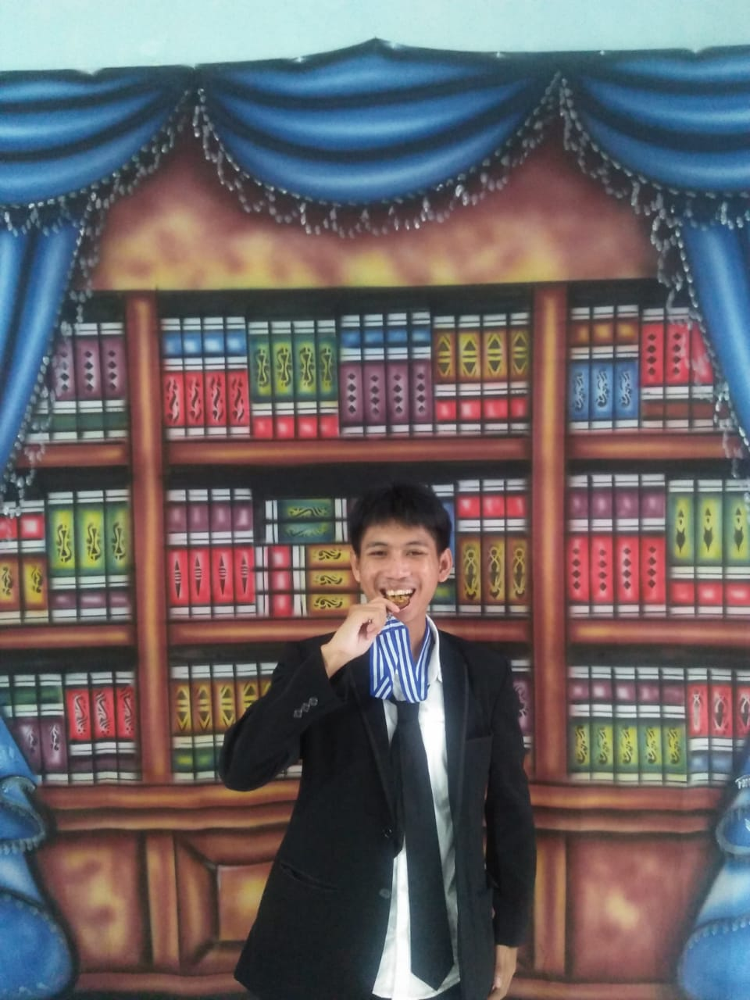
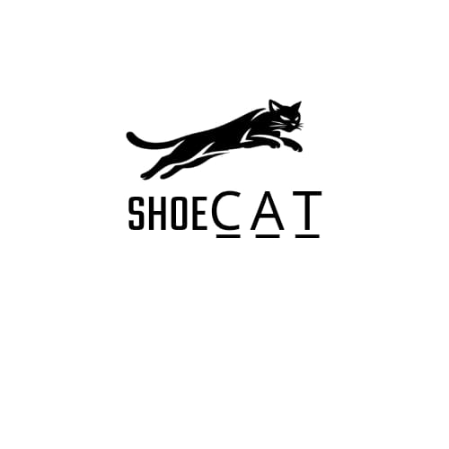

<!DOCTYPE html>
<html lang="id">
<head>
  <meta charset="UTF-8">
  <meta name="viewport" content="width=device-width, initial-scale=1.0">
  <title>Akmal - Belajar & Berbagi tentang Teknologi Jaringan</title>

  <link href="https://fonts.googleapis.com/css2?family=Poppins:wght@300;600&display=swap" rel="stylesheet">

  
</head>

<body>

<header>
  <h1>Akmal</h1>
  
Belajar & Berbagi tentang Teknologi Jaringan

  

    
  

</header>

<section>
  <h2>Tentang Saya</h2>
  
Teknologi adalah passion saya. Saya senang mempelajari sistem jaringan, konfigurasi perangkat, dan solusi digital.

</section>

<section>
  <h2>Keahlian</h2>
  <ul>
    <li>Konfigurasi Mikrotik</li>
    <li>Desain visual (Canva)</li>
    <li>Editing video (CapCut)</li>
    <li>Software pendukung teknologi</li>
  </ul>
</section>

<section>
  <h2>Portofolio</h2>
  

    

      
      <h3>Shoe Cat</h3>
      
Logo brand sepatu Shoe Cat dengan konsep sport & street.

    

    

      
      <h3>Pencak Silat Walet Putih</h3>
      
Logo pendepokan Mustika Walet Putih.

    

    

      
      <h3>Walet Putih Kab. Bogor</h3>
      
Logo pencak silat Walet Putih Kabupaten Bogor.

    

    

      
      <h3>Desain Promosi Sepatu</h3>
      
Desain visual promosi sepatu.

    

  

</section>

<!-- ===== AKTIVITAS WINBOX ===== -->
<section>
  <h2>Dokumentasi Praktik TKJ - 25 Mei 2025</h2>

  

    

      
      <h3>Konfigurasi Awal Router MikroTik</h3>
      
Pengaturan IP Address, konfigurasi interface, dan pengecekan koneksi jaringan menggunakan Winbox.

    

    

      
      <h3>Praktik Jaringan di Lab TKJ</h3>
      
Praktik konfigurasi jaringan bersama di laboratorium TKJ dengan pengawasan guru.

    

    

      
      <h3>Monitoring & Troubleshooting</h3>
      
Monitoring traffic jaringan serta troubleshooting untuk memastikan koneksi stabil.

    

  

</section>

<section>
  <h2>Kontak</h2>
  

    <a href="https://www.instagram.com/akmal.mgr?igsh=anBsODV1ZmJxNHVh" target="_blank">Instagram</a>
    <a href="https://wa.me/6288214263826" target="_blank">WhatsApp</a>
    <a href="https://t.me/akmalcher" target="_blank">Telegram</a>
    <a href="mailto:akmalalmagribi6@gmail.com">Email</a>
    <a href="https://youtube.com/@noircam" target="_blank">YouTube</a>
  

</section>

<section>
  <h2>Formulir Kontak</h2>
  <form class="contact-form">
    <input type="text" placeholder="Nama Lengkap">
    <input type="email" placeholder="Email Aktif">
    <textarea rows="5" placeholder="Tulis pesan kamu di sini..."></textarea>
    <button type="submit">Kirim</button>
  </form>
</section>

<footer>
  
&copy; 2025 Akmal. All rights reserved.

</footer>

</body>
</html>
